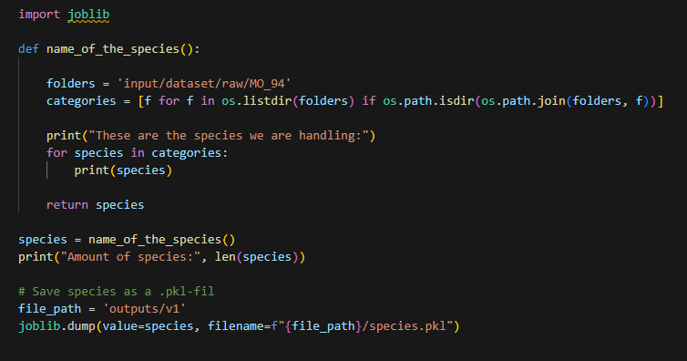
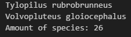
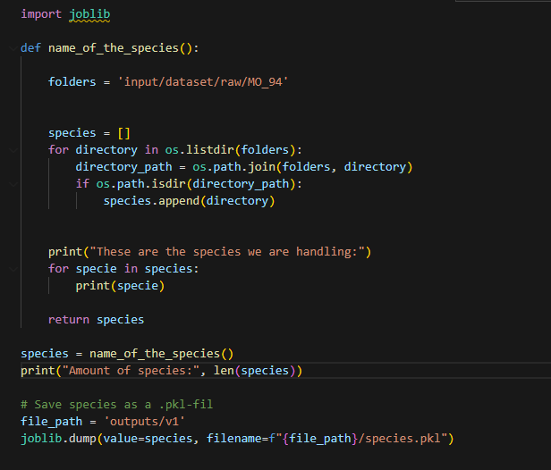
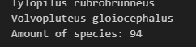

# Mushroom_edible_gallery
Predictive image analytics that going to show what type of mushroom you picked and if you can eat it.

## Hypotheses

**1. What mushroom have I picked?** 
- When a user uploading an image of a mushroom it can be analysed and predict 
what species of mushroom the image contains.  

**2. Can you eat the mushroom?** 
- By having a dataset with every category of mushroom species that handles the info if it´s edible or not. With this the accuracy of the image has to be over 80% so that the pickers don´t eat a toxic mushroom.  

**3. Are there any similiar mushrooms to this?** 
- When the system has identified the predictive species, there will also be images of similiar species that can be confused with.

## Business case

- **Users are interested to upload images on mushrooms and get a analysis of what species it can be.** 
*Goals:* - Image visualisation of what type of species the user has uploaded. - Image visualisation of species that can be cunfused with.

- **Users are interested to know if they can or can´t eat the mushroom.** *Goals:* - Have atleast 75% accuracy to predict a specie before telling if it´s toxic or not. 

# Problems that occur during this project

### **Can´t find all directories** 
When I´m about to save all directories to a `.pkl`-file my code only finds 26 out of the 94 directories with this code: 
 
This is the result of that code:  
 
### *Solution:* 
Creating an array that iterates through the folders and collecting all the names of the directories. 
 
This is the result after changing to this code:  
